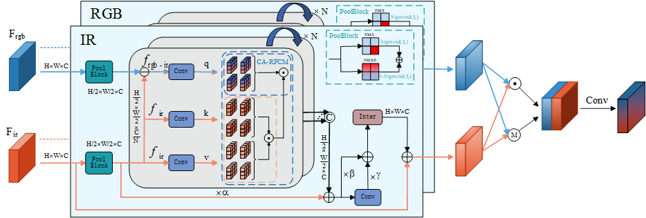

The code of Regional Defeats Global: An Efficient Regional Feature Fusion via Convolutional Architecture for Multispectral Object Detection

To address the computational overhead introduced by the widespread use of global modeling architectures in current multispectral fusion research, we propose a constrained-computation solution by introducing a region-based feature computation mechanism.

 

 

The source code is currently being organized and will be released soon.
