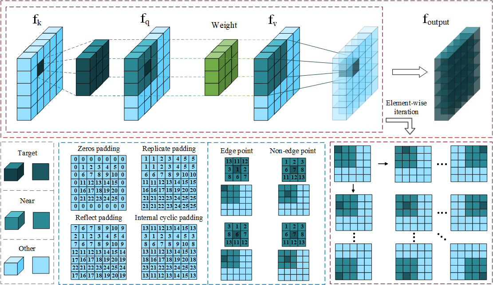

The code of Regional Defeats Global: A Convolutional Architecture-based Region Feature Computation Mechanism for Visible-Infrared Object Detection

To address the computational overhead introduced by the widespread use of global modeling architectures in current multispectral fusion research, we propose a constrained-computation solution by introducing a region-based feature computation mechanism.

 

 

Source code will be made available upon paper acceptance.
